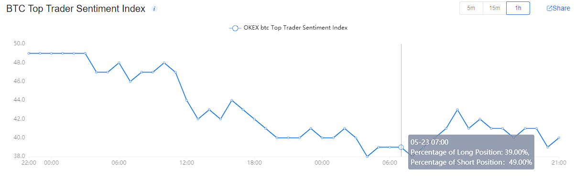

# BTC Top Trader Sentiment Index

Note: It is developed on okex.com [public data](https://www.okex.com/markets/futures-data/btc-usd-weekly)

Telegram Bot URL: https://t.me/BTCTopTraderSentimentIndex_bot

## How to work?

The Top Trader Sentiment Index reflects the percentage of long vs short positions held by the top 100 traders. 

The Telegram bot notify you ONLY when long or short values are greatest of 50%. For future usage, I add also the BTC / USD value

## BOT screenshot

TODO
